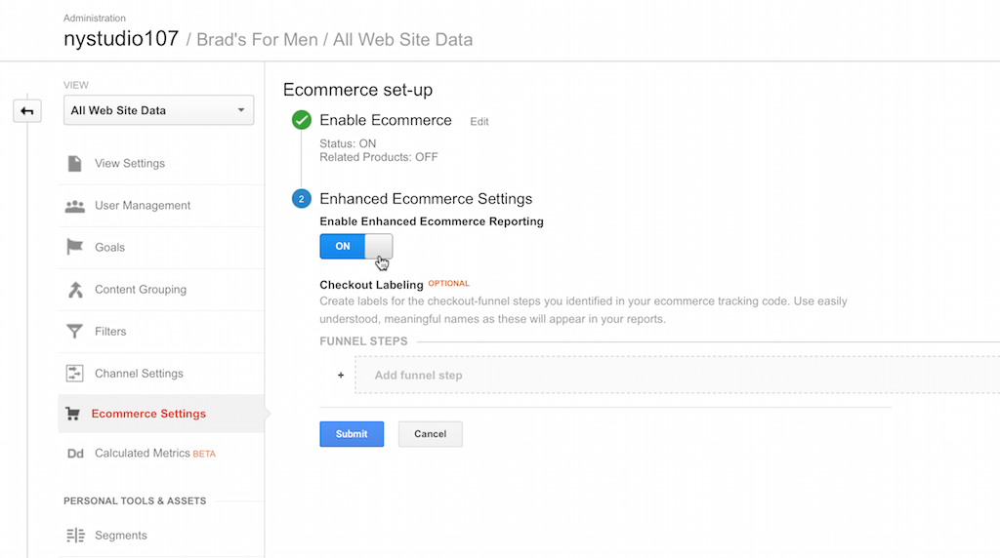
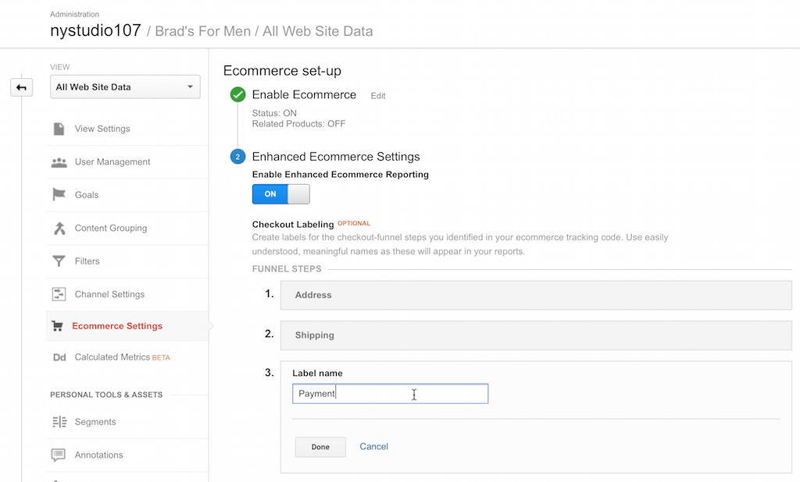
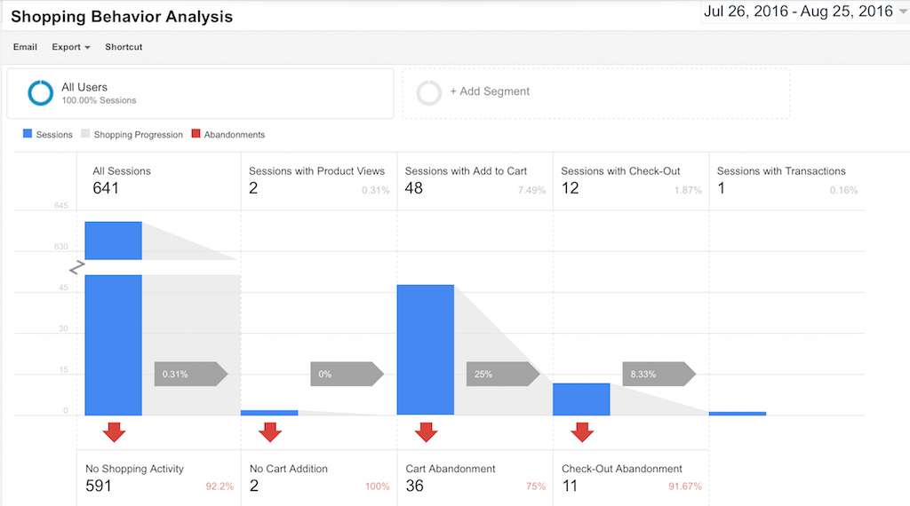
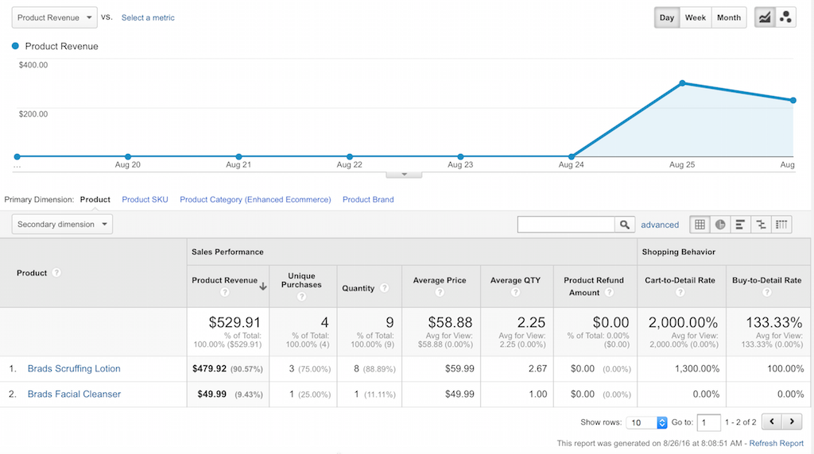

# Instant Analytics plugin for Craft CMS

Instant Analytics brings full Google Analytics support to your Twig templates and automatic Craft Commerce integration with Google Enhanced Ecommerce.

## Installation

To install Instant Analytics, follow these steps:

1. Download & unzip the file and place the `instantanalytics` directory into your `craft/plugins` directory
2.  -OR- do a `git clone https://github.com/nystudio107/instantanalytics.git` directly into your `craft/plugins` folder.  You can then update it with `git pull`
3. -OR- install with Composer via `composer require nystudio107/instantanalytics`
4. Install plugin in the Craft Control Panel under Settings > Plugins
5. The plugin folder should be named `instantanalytics` for Craft to see it.  GitHub recently started appending `-master` (the branch name) to the name of the folder for zip file downloads.

Instant Analytics works on Craft 2.4.x, Craft 2.5.x, and Craft 2.6.x.  It requires at least PHP 5.5 or later to work.

N.B.: Version 1.1 of Instant Analytics has breaking API changes from the 1.0.x version.  You will need to add `` to your templates to send Google Analytics data.  In addition, the Twig tags `sendEvent` and `sendPageView` are deprecated; instead use `eventAnalytics` and `pageViewAnalytics` respectively to return an `Analtyics` object (see below).

## Instant Analytics Overview

Instant Analytics brings full Google Analytics support to your Twig templates and automatic Craft Commerce integration with Google Enhanced Ecommerce.

Instant Analytics also lets you track otherwise untrackable assets & events with Google Analytics, and eliminates the need for Javascript tracking.

You don't need to include the typical Google Analytics script tag on your pages, instead Instant Analytics will send page views when your front-end templates are rendered via the officially supported [Google Measurement Protocol](https://developers.google.com/analytics/devguides/collection/protocol/v1/).

You can also track asset/media views in Google Analytics, either as PageViews or as Events. This lets you track otherwise untrackable things such as individual RSS feed accesses, images, PDF files, etc.

Instant Analytics is implemented on the demo site [Brads for Men](https://bradsformen.com)

## Use Cases

### Simple Page Tracking

If all you want is simple page tracking data sent to Google Analytics, Instant Analytics will do that for you automatically.  Instant Analytics uses the [Google Measurement Protocol](https://developers.google.com/analytics/devguides/collection/protocol/v1/) to send PageViews to your Google Analytics account the same way the Google Analytics Tracking Code Javascript tag does.

In addition, Instant Analytics injects an `instantAnalytics` object into your templates, which you can manipulate as you see fit, adding Google Analytics properties to be sent along with your PageView.

It has the added benefit of not having to load any Javascript on the front-end to do this, which results in the following benefits:

* Your pages will render quicker in-browser, with no external resources loaded just for PageView tracking
* Pages will be tracked even if the client's browser has Javascript disabled or blocked
* Javascript errors will not cause Google Analytics data to fail to be collected

### Craft Commerce Integration with Google Enhanced Ecommerce

If you are using Craft Commerce, Instant Analytics will recognize this, and automatically send Google Enhanced Ecommerce data for the following actions:

* **Add to Cart** - When someone adds an item from your Craft Commerce store to their cart.  This will include data for the Product or Variant that was added to the cart.
* **Remove from Cart** - When someone removes an item from your Craft Commerce store cart (requires Craft Commerce 1.2.x or later).  This will include data for the Product or Variant that was removed from the cart.
* **Purchase** - When someone completes a purchase in your Craft Commerce store.  This will include all of the LineItems that were added to the cart, as well as the TransactionID, Revenue, Tax, Shipping, and Coupon Code used (if any).

Additionally, you can add simple Twig tags to your templates to track Product Impressions, Product Detail Views, and track each step of the Checkout process.  In Google Analytics, you will be able to view detailed information on the sales from your Craft Commerce store, and other useful information such as where customers are abandoning their cart in the Checkout process.

### Tracking Assets/Resources

Instant Analytics lets you track assets/resources that you can't normally track.  For instance, you may have a collection of PDF documents that you'd like to know when they are viewed.

Using a simple `{{ pageViewTrackingUrl(myAsset.url, myAsset.title) }}` or `{{ eventTrackingUrl(myAsset.url, myAsset.title, "action", "label", "value") }}` Twig function, Instant Analytics will generate a public URL that will register a PageView in Google Analytics for the asset/resource, and then display or download the asset/resource.

### Tracking RSS Feeds

Getting actual tracking statistics on RSS feeds can be notoriously difficult, because they are often consumed by clients that are not web browsers, and therefor will not run Javascript tracking code.

With Instant Analytics, if your RSS feed is a Twig template, accesses will automatically be tracked.  Additionally, you can use the `{{ pageViewTrackingUrl(myAsset.url, myAsset.title) }}` or `{{ eventTrackingUrl(myAsset.url, myAsset.title, "action", "label", "value") }}` Twig functions to track individual episode accesses in Google Analytics.

### Custom Tracking via Twig or Plugin

If your needs are more specialized, Instant Analytics will give your Twig templates or plugin full access to an `Analytics` object that allows you to send arbitrary Google Analytics tracking data to Google Analytics.

You can do anything from customized PageViews to complicated Google Enhanced eCommerce tracking, 

## Configuring Instant Analytics

Once you have installed Instant Analytics, you'll see a welcome screen.  Click on **Get Started** to configure Instant Analytics:

* **Google Analytics Tracking ID:** Enter your Google Analytics Tracking ID here. Only enter the ID, e.g.: UA-XXXXXX-XX, not the entire script code.
* **Strip Query String from PageView URLs:** If this setting is on, the query string will be stripped from PageView URLs before being sent to Google Analytics.  e.g.: `/some/path?token=1235312` would be sent as just `/some/path`
* **Auto Send "Add To Cart" Events:** If this setting is on, Google Analytics Enhanced Ecommerce events are automatically sent when an item is added to your Craft Commerce cart.
* **Auto Send "Remove From Cart" Events:** If this setting is on, Google Analytics Enhanced Ecommerce events are automatically sent when an item is removed from your Craft Commerce cart.
* **Auto Send "Purchase Complete" Events:** If this setting is on, Google Analytics Enhanced Ecommerce events are automatically sent a purchase is completed.
* **Commerce Product Category Field:** Choose the field in your Product or Variant field layout that should be used for the product's Category field for Google Analytics Enhanced Ecommerce
* **Commerce Product Brand Field** Choose the field in your Product or Variant field layout that should be used for the product's Brand field for Google Analytics Enhanced Ecommerce

If you have the [SEOmatic](https://github.com/nystudio107/seomatic) plugin installed, Instant Analytics will automatically grab your **Google Analytics Tracking ID:** from it.

**NOTE:** Instant Analytics will work with the traditional Google Analytics Tracking Code Javascript tag; it's not an either/or, they can coexist.  Instant Analytics is just a different way to send the same data to Google Analytics.

However, to prevent duplicate data from being sent, if you use Instant Analytics to send PageView data, you should turn off the Javascript sending PageViews automatically by:

* In [SEOmatic](https://github.com/nystudio107/seomatic) turn off **Automatically send Google Analytics PageView**
* If you don't use SEOmatic, remove the line `ga('send', 'pageview');` from your Google Analytics Tracking Code Javascript tag

Then you can still use the `ga()` calls to send events to Google Analytics.  Or, if you don't send events via Javascript, you can just remove the Google Analytics tag/Javascript from your page entirely.

### Customizing via the config.php file

Instant Analytics has a number of other configuration options that can be customized on a per-environment basis via the `config.php` file.  Don't edit this file, instead copy it to `craft/config` as `instantanalytics.php` (rename it) and make your changes there.

## Using Instant Analytics

### Simple Page Tracking

Once you've entered your **Google Analytics Tracking ID** you just need to add a call to `` to your front-end templates to send PageView tracking to Google Analytics.  We recommend that you do this in a block at the bottom of your `layout.twig` template that other templates extend, right before the `</body>` tag, like this:

    
        
    

That's it!  Once you have added this hook, Instant Analytics will start sending PageViews to Google Analytics. It does not send any Google Analytics data if:

* You have not entered a valid **Google Analytics Tracking ID:**
* You are viewing templates in Live Preview
* The request is a CP or Console request
* If you have `sendAnalyticsData` set to false in the `config.php` file

By default, the "title" used for your pages is the current template path; if you have [SEOmatic](https://github.com/nystudio107/seomatic) installed, Instant Analytics will automatically grab the current page title from it.

#### Advanced Page Tracking

This is where the fun begins.  Instant Analytics injects an `instantAnalytics` object into your templates, the same way that Craft injects an `entry` object or Craft Commerce injects a `product` object.  This is the actual `Analytics` object that the `` will send to Google Analytics.

You can manipulate this object as you see fit, adding data to be sent to Google Analytics along with your PageView.

For example, let's say that you want to add an `Affiliation`:

    

Or perhaps for a particular page, you want to change the the `Tracking ID` used by Google Analytics:

    

Or do them both at the same time:

    

You can add or change any property defined in the [Google Analytics Measurement Protocol library for PHP](https://github.com/theiconic/php-ga-measurement-protocol) that Instant Analytics uses.

By default, the injected `instantAnalytics` object is filled in with the following info:

* `instantAnalytics.setProtocolVersion('1')`
* `instantAnalytics.setTrackingId(YOUR_TRACKING_ID)`
* `instantAnalytics.setIpOverride($_SERVER['REMOTE_ADDR'])`
* `instantAnalytics.setUserAgentOverride($_SERVER['HTTP_USER_AGENT'])`
* `instantAnalytics.setDocumentReferrer($_SERVER['HTTP_REFERER'])`
* `instantAnalytics.setClientId(CID)`
* `instantAnalytics.setDocumentPath(craft.request.url)`
* `instantAnalytics.setDocumentTitle(TEMPLATE_PATH)`

If the SEOmatic plugin is installed, then it is used to set the title:

* `instantAnalytics.setDocumentTitle(seomaticMeta.seoTitle)`

If there is a `gclid` cookie (used for Google AdWords tracking), this will also be set:

* `instantAnalytics.setGoogleAdwordsId(GCLID)`

### Craft Commerce Tracking with Google Enhanced Ecommerce

If you are using Craft Commerce, Instant Analytics will recognize this, and automatically send Google Enhanced Ecommerce data for the following actions:

* **Add to Cart** - When someone adds an item from your Craft Commerce store to their cart.  This will include data for the Product or Variant that was added to the cart.
* **Remove from Cart** - When someone removes an item from your Craft Commerce store cart (requires Craft Commerce 1.2.x or later).  This will include data for the Product or Variant that was removed from the cart.
* **Purchase** - When someone completes a purchase in your Craft Commerce store.  This will include all of the LineItems that were added to the cart, as well as the TransactionID, Revenue, Tax, Shipping, and Coupon Code used (if any).

You simply need to enable Enhanced Ecommerce in your Google Analytics Admin area for your website's property:

That's it!  It'll just work.  In addition to the basic automatic tracking that Instant Analytics does, you can use the `instantAnalytics` object to send additional data to Google Analytics Enhanced Ecommerce:

* `` - This will add an _impression_ for a given Craft Commerce `Product` or `Variant` (you can pass in either in `PRODUCT_VARIANT`).  `INDEX` must be a number between 1-200, and is the position in the list of products where this product appears. This should be used on product listing pages that show a number of products, to indicate that the user has been shown a particular product. `LIST_NAME` and `LIST_INDEX` are optional; they let you set the product list name, and the index of that list, which is a number from 1-200, and should be unique to the list. `LIST_NAME` defaults to `default` and `LIST_INDEX` defaults to `1` if not specified.
*  `` - This will add a _product detail view_ for a given Craft Commerce `Product` or `Variant` (you can pass in either in `PRODUCT_VARIANT`).  This should be used when the user is shown the detail view of a product.
*  `` - This will add a _checkout step_ for a given Craft Commerce `CART` (obtained via `craft.commerce.cart`).  The `STEP` parameter lets you specify which step in the checkout process you are on, and the `OPTION` parameter is optional information you can associate with this checkout step, e.g.: `Shipping Info` or `VISA`.

You can set up names for each of the Checkout Steps in your Google Analytics Admin area for your website's property:

Once you are using these tags in your templates, Google Analytics Enhanced Ecommerce will be able to provide you with extended analysis of things like at what step in your Checkout process people abandon their carts, which products people are looking at detailed views of, etc.:

In addition to the expected sales data:

### Sending Events

You can obtain an `Analytics` object preloaded to send events to Google Analytics via either:

    
    -OR-
    

What `CATEGORY`, `ACTION`, `LABEL`, and `VALUE` are is completely up to you; you can provide whatever data makes sense for your application, and view it in Google Analytics.  See [Event Tracking](https://developers.google.com/analytics/devguides/collection/analyticsjs/events) for more information.

By default, the injected `instantAnalytics` object is filled in with the following info:

* `myAnalytics.setProtocolVersion('1')`
* `myAnalytics.setTrackingId(YOUR_TRACKING_ID)`
* `myAnalytics.setIpOverride($_SERVER['REMOTE_ADDR'])`
* `myAnalytics.setUserAgentOverride($_SERVER['HTTP_USER_AGENT'])`
* `myAnalytics.setDocumentHostName($_SERVER['SERVER_NAME'])`
* `myAnalytics.setDocumentReferrer($_SERVER['HTTP_REFERER'])`
* `myAnalytics.setClientId(CID)`
* `myAnalytics.setEventCategory(CATEGORY)`
* `myAnalytics.setEventAction(ACTION)`
* `myAnalytics.setEventLabel(LABEL)`
* `myAnalytics.setEventValue(VALUE)`

If there is a `gclid` cookie (used for Google AdWords tracking), this will also be set:

* `myAnalytics.setGoogleAdwordsId(GCLID)`

You manipulate the `myAnalytics` object as you see fit, adding or changing any property defined in the [Google Analytics Measurement Protocol library for PHP](https://github.com/theiconic/php-ga-measurement-protocol) that Instant Analytics uses.

However, the event **will not be sent** to Google Analytics until you tell it to via:

    

A complete example might be:

    
    

### Tracking Assets/Resources

Instant Analytics lets you track assets/resources that you can't normally track, by providing a tracking URL that you use in your front-end templates.

You can track as PageViews via either:

    {{ pageViewTrackingUrl(URL, TITLE) }}
    -OR-
    {{ craft.instantAnalytics.pageViewTrackingUrl(URL, TITLE) }}

Or you can track as Events via either:

    {{ eventTrackingUrl(URL, CATEGORY, ACTION, LABEL, VALUE) }}
    -OR-
    {{ craft.instantAnalytics.eventTrackingUrl(URL, CATEGORY, ACTION, LABEL, VALUE) }}

These can be wrapped around any URL, so you could wrap your tracking URL around an image, a PDF, or an externally linked file... whatever.

What happens when the link is clicked on is Instant Analytics sends the tracking PageView or Event to Google Analytics, and then the original URL is seamlessly accessed.

The URL that Instant Analytics generates will look like this:

    http://yoursite.com/instantAnalytics/pageViewTrack/FILENAME.EXT?url=XXX&title=AAA
    -OR-
    http://yoursite.com/instantAnalytics/eventTrack/FILENAME.EXT?url=XXX&eventCategory=AAA&eventAction=BBB&eventLabel=CCC&eventValue=DDD

It's done this way so that the URL can be directly used in RSS feeds for the media object URLs, which require that the filename is in the URL path.

### Custom Tracking via Twig or Plugin

If your needs are more specialized, you can build arbitrary Google Analytics data packets with Instant Analytics.  To get an `Analytics` object do the following:

Twig:

    

PHP via Plugin:

    $myAnalytics = craft()->instantAnalytics->analytics();

In either case, you will be returned an `Analytics` object that is initialized with the following settings for you:

    $myAnalytics->setProtocolVersion('1')
        ->setTrackingId(YOUR_TRACKING_ID)
        ->setIpOverride($_SERVER['REMOTE_ADDR'])
        ->setAsyncRequest(false)
        ->setClientId(CID);
        ->setGoogleAdwordsId(GCLID);

You are then free to change any of the parameters as you see fit via the [Google Analytics Measurement Protocol library for PHP](https://github.com/theiconic/php-ga-measurement-protocol)

Here's a simple example where we send a PageView for a specific page (after adding an Affiliation):

Twig:

    
    

PHP via Plugin:

    $myAnalytics = craft()->instantAnalytics->analytics();
    $myAnalytics->setDocumentPath('/some/page')
        ->setAffiliation('nystudio107')
        ->sendPageview();

The sky's the limit in either case, you can do anything from simple PageViews to complicated Google Enhanced eCommerce analytics tracking.

## Instant Analytics Roadmap

Some things to do, and ideas for potential features:

* Support for additional Craft Commerce data such as Refunds

## Instant Analytics Changelog

### 1.1.5 -- 2016.12.21

* [Improved] Fixed the Analytics Excludes
* [Added] Added support for DigitalProducts and other base purchaseables
* [Added] Added `UptimeRobot` to the crawlers list
* [Improved] Rolled the multi-env aware `config.php` back; Craft doesn't work that way
* [Improved] Updated README.md

### 1.1.4 -- 2016.12.20

* [Fixed] `addCommerceProductImpression()` now works properly
* [Improved] Made the default `config.php` multi-environment
* [Added] Added extensive logging of excluded analytics data
* [Added] Added `logExcludedAnalytics` config.php setting
* [Fixed] Fixed an issue that would cause InstantAnalytics to not filter out bots properly
* [Improved] `DocumentHostName` is now set by default
* [Improved] Fixed a CSS file typo in the `welcome.twig` template
* [Improved] Updated to the latest vendor deps
* [Improved] Updated README.md

### 1.1.3 -- 2016.09.23

* [Improved] Don't redirect to the welcome page if we're being installed via Console command
* [Improved] Updated README.md

### 1.1.2 -- 2016.09.18

* [Improved] The URLs returned by `pageViewTrackingUrl()` and `eventTrackingUrl()` will now work even if there is no filename in the URL
* [Improved] Added a global config option to strip the query string from PageView URLs
* [Improved] The `_ia` cookie is now set on `/`
* [Fixed] Tracking URL params are no longer double url encoded
* [Improved] Updated README.md

### 1.1.1 -- 2016.08.29

* [Added] Added `Category` and `Brand` fields to the Settings, so you can specify what fields this data for Google Enhanced Ecommerce should be pulled from
* [Improved] Changed the PageView Tracking URL and Event Tracking URL format so that they can be included in RSS feeds directly
* [Improved] We do a better job checking to see if the Commerce and SEOmatic plugins are installed
* [Added] If SEOmatic is installed, we automatically do a `setAffiliation` for the Analytics object, using the `siteSeoName`
* [Added] You can now discretely choose which Google Enhanced Ecommerce events are automatically sent
* [Added] A product's `Category` is by default set to the name of the Product Type
* [Improved] Updated README.md

### 1.1.0 -- 2016.08.26

* [Added] Refactored the code so that an `instantAnalytics` object is now injected into your templates so you can manipulate it as you see fit, and then use `` to send the PageView
* [Added] Automatic Google Enhanced Ecommerce tracking of Craft Commerce OrderComplete
* [Added] Automatic Google Enhanced Ecommerce tracking of Craft Commerce AddToCart
* [Added] Automatic Google Enhanced Ecommerce tracking of Craft Commerce RemoveFromCart
* [Added] Added addCommerceProductImpression() to the IAnalytics object to allow for sending of product impressions
* [Added] Added addCommerceProductDetailView() to the IAnalytics object to allow for sending of product detail views
* [Added] Added addCommerceCheckoutStep() to the IAnalytics object to allow for sending of cart checkout steps
* [Improved] Updated to the latest Google Measurement Protocol (2.3.0)
* [Improved] Added debug logging when in `devMode` for any Analytics data that is sent
* [Improved] Fall back on a default User Agent when `$_SERVER['HTTP_USER_AGENT']` is not set
* [Added] We now send HTTP_REFERER by default
* [Improved] Updated README.md

### 1.0.5 -- 2016.08.16

* [Fixed] If there is no _ga cookie set, we generate a UUID and set it, to allow sessions to work correctly
* [Added] Added the $title parameter to sendPageView()
* [Improved] Updated README.md

### 1.0.4 -- 2016.08.08

* [Added] Added an adminExclude setting in config.php for anyone logged in using an admin for Analytics data exclusion
* [Improved] AI now ensures that the pageview URLs are not absolute URLs
* [Improved] Updated README.md

### 1.0.3 -- 2016.06.19

* [Added] Added a bot UserAgent filter list (on by default), configurable via filterBotUserAgents in config.php
* [Added] Added groupExcludes setting in config.php that has an array of Craft user group handles for Analytics data exclusion
* [Added] Added serverExcludes setting in config.php that has arrays of $_SERVER[] superglobal RegEx tests for Analytics data exclusion
* [Improved] The various _shouldSendAnalytics() tests now short-circuit, returning as soon as a false condition is met
* [Improved] Updated README.md

### 1.0.2 -- 2016.06.16

* [Fixed] The UserAgent is now set to the client UserAgent by default
* [Improved] Added a sendAnalyticsData setting to config.php
* [Improved] Updated README.md

### 1.0.1 -- 2016.06.14

* [Added] Updated to a newer version of the GAMP lib for PHP, which uses Guzzle 6.x
* [Fixed] No more Composer dependency conflicts with the Oauth 2.0 plugin
* [Improved] Updated README.md

### 1.0.0 -- 2016.06.13

* Initial release

Brought to you by [nystudio107](http://nystudio107.com)